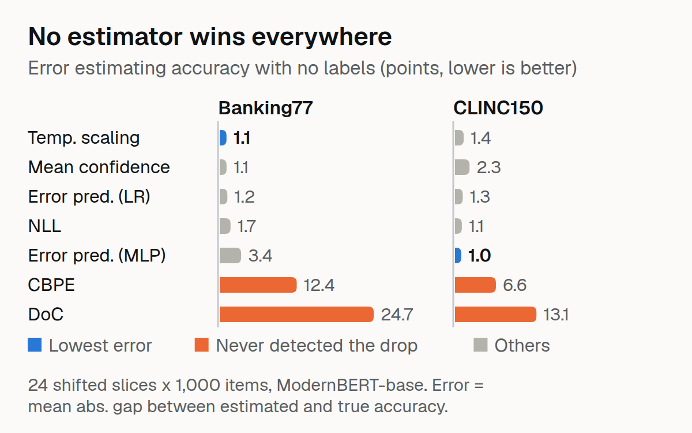

# ShiftWatch

Estimate a deployed classifier's accuracy after a data shift, before any labels arrive.



Write-up: [How Accurate Is Your Model Right Now? Estimating Accuracy Without Labels](https://dev.to/raihan-js/how-accurate-is-your-model-right-now-estimating-accuracy-without-labels-59kp)

## The problem

Drift dashboards alert on input statistics that don't track failure. The production question is: **what is my accuracy right now, with no labels?**

## The approach

Benchmark six label-free accuracy estimators (plus an MLP variant of the error predictor, so results show seven rows) on a controlled shift ladder:

| Estimator | Source | Key idea |
|---|---|---|
| Mean confidence | — | Naive: mean max softmax |
| Temperature scaling | Guo et al. 2017 | Fit T on source val, then mean confidence |
| DoC | Liang et al. 2023 | Source accuracy + (source conf − target conf) |
| CBPE | NannyML | Per-class recall from calibrated probs |
| NLL | — | Calibrated: exp(−mean NLL) |
| Error predictor | — | Logistic regression on confidence features |

ATC (Garg et al. 2022) is omitted: its self-agreement requires sampling, which degenerates under greedy decoding.

## The shift ladder

Deterministic, rule-based corruptions (no GPU, no LLM):

- **Typos**: keyboard-adjacent swaps, deletions, duplications (3 severities)
- **Abbreviations**: domain word → abbreviation (3 severities)
- **Style**: lowercasing, punctuation removal, politeness padding, whitespace noise (3 severities)
- **OOS contamination**: replace X% of in-scope texts with out-of-scope ones (10/20/30/40%)

Two datasets: Banking77 (77 classes) and CLINC150 (150 classes + OOS).

## The sidecar

A small FastAPI service that:
- Accepts probability vectors (never labels)
- Keeps a rolling window of predictions
- Republishes estimated accuracy with the winning estimator
- Exports Prometheus gauges and an alert flag

## Results

Two datasets, 24 slices total (1,000 items each), ModernBERT-base classifiers.

**Reading the columns.** MAE is the mean absolute gap between estimated and true accuracy over the 24 slices. *Detect* is the share of slices with a true accuracy drop of at least 5 points that the estimator also flagged (estimated drop of at least 5 points). *False Alarm* is the share of the other slices it flagged anyway. Both use the 5-point threshold the sidecar defaults to. These rates rest on small counts: in each dataset 6 slices have a true drop of at least 5 points, so a detect rate of 0.83 is 5 of 6, and Banking77's false-alarm rate of 0.25 is 1 of 4 non-drop slices.

### Banking77 (77 classes, clean accuracy 92.7%)

| Estimator | MAE | Bias | Detect | False Alarm |
|---|---|---|---|---|
| temp_scaled | 0.0109 | -0.0035 | 1.00 | 0.25 |
| mean_confidence | 0.0110 | -0.0017 | 1.00 | 0.00 |
| error_predictor | 0.0123 | +0.0043 | 1.00 | 0.00 |
| nll | 0.0174 | -0.0090 | 1.00 | 0.00 |
| error_predictor_mlp | 0.0344 | +0.0266 | 1.00 | 0.00 |
| cbpe | 0.1237 | +0.1213 | 0.00 | 0.00 |
| doc | 0.2473 | +0.2453 | 0.00 | 0.00 |

### CLINC150 (151 classes, clean accuracy 89.6%)

| Estimator | MAE | Bias | Detect | False Alarm |
|---|---|---|---|---|
| error_predictor_mlp | 0.0101 | +0.0035 | 0.83 | 0.00 |
| nll | 0.0110 | -0.0021 | 1.00 | 0.00 |
| error_predictor | 0.0125 | +0.0038 | 0.83 | 0.00 |
| temp_scaled | 0.0140 | +0.0007 | 0.83 | 0.00 |
| mean_confidence | 0.0234 | +0.0164 | 0.50 | 0.00 |
| cbpe | 0.0657 | +0.0656 | 0.00 | 0.00 |
| doc | 0.1308 | +0.1308 | 0.00 | 0.00 |

### Key finding

**No single estimator dominates.** On Banking77 temperature scaling and mean confidence are tied (MAE 0.0109 vs 0.0110, within noise of each other); on CLINC150, where out-of-scope contamination breaks calibration, the MLP error predictor leads (0.0101, with NLL at 0.0110). DoC and CBPE fail to detect drops on both datasets: they are too optimistic under shift.

## Estimator notes

- **Mean confidence** is optimistic under confident-wrong shifts.
- **Temperature scaling** calibrates on source but may not transfer under shift.
- **DoC** captures confidence degradation but assumes source accuracy is known.
- **CBPE** captures class distribution shift but not confidence degradation.
- **NLL** is similar to temperature scaling but uses log-probabilities.
- **Error predictor** learns from source features but may not transfer under shift.

## Usage

```bash
# Train
PYTHONPATH=src python scripts/train_classifier.py --dataset banking77

# Build ladder
PYTHONPATH=src python scripts/build_ladder.py --dataset banking77

# Benchmark
PYTHONPATH=src python scripts/run_benchmark.py --dataset banking77

# Serve
shiftwatch serve --dataset clinc150 --estimator error_predictor
```

The sidecar defaults to `error_predictor`: top three on both datasets with no false alarms. (An earlier default, `cbpe`, never detected a drop in this benchmark.)

## Limitations

- Two datasets, both intent classification — no vision or NLU.
- Shift ladder is rule-based; real-world shifts are messier.
- Estimators assume the model is reasonably calibrated on source.
- Sidecar is a prototype, not production-hardened.

## License

MIT
